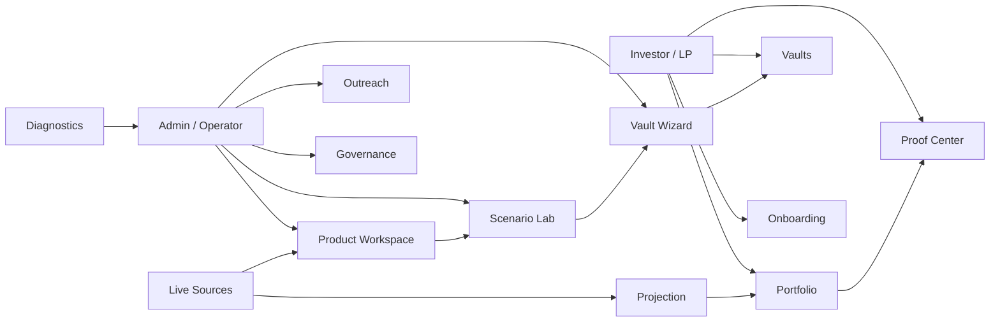
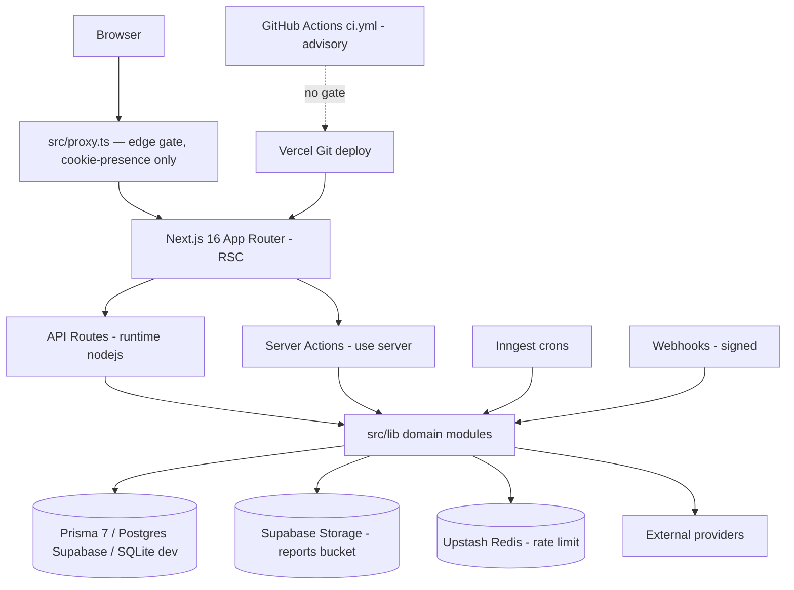
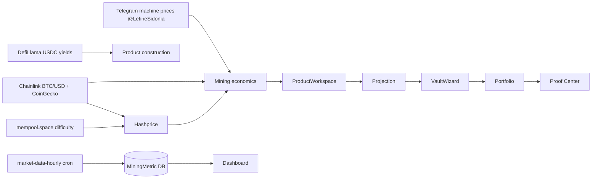
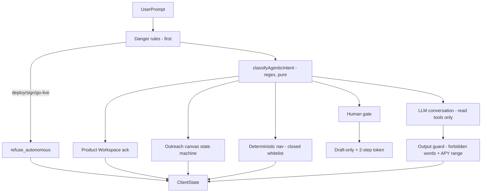

# Hearst Connect DeFi Platform Canvas

> **What this is.** A single readable map of the Hearst Connect platform — architecture,
> infra, data, agents, flows, pages, gates, and the next execution lots. Read it like a
> platform map, not a manual. Every claim is sourced from the repo (file paths inline);
> nothing here is invented. Docs-only artifact — **no runtime logic, DB, auth, chat/router,
> or product-calculation code was touched to produce it.**
>
> Snapshot: `main` @ `46cb8c11` · 2026-07-05 · Next.js 16 App Router · TS strict · Tailwind v4 · Prisma 7 + Postgres (Supabase prod) / SQLite (dev) · Inngest crons · OpenAI GPT-4.1 (ADR-011).

---

## 1. Executive overview

**Hearst Connect** is a single-vault institutional DeFi platform — the **Hearst Yield Vault**:
mining-backed structured yield, monthly USDC distributions, target APY range 8–15%, Cayman SPV
structure, $250k min ticket, 60-day soft lock-up. Multi-vault is allowed as a first-class key
(Yield / Defensive / BTC Plus — ADR-006) with per-vault assumptions and provenance.

The product is **built out, not a skeleton**. Three layers coexist:

| Layer | What lives here | Where |
|---|---|---|
| **Presentation** | Investor cockpit (portfolio, vaults, proof-center, profile) + admin console (~45 pages) on the 3-column Cockpit shell | `src/app/(product)/*`, `src/app/admin/*`, `cockpit-shell/*` |
| **Domain / compute** | Pure scenario/risk/projection engine, 4 GPT-4.1 batch agents + LP Master Agent, deterministic intent router, data adapters | `src/lib/engine/*`, `src/lib/agents/*`, `src/lib/llm/*`, `src/lib/agentic/*`, `src/lib/data/*` |
| **Infrastructure** | Auth/session, server actions, API routes + webhooks, Inngest crons, Prisma/Postgres, Supabase Storage, Base Sepolia contracts | `src/lib/auth/*`, `src/app/actions/*`, `src/app/api/*`, `src/lib/inngest/*`, `contracts/*` |

**Six invariants define the platform's character** (CI-enforced, ADR-backed):

1. **APY is always a range** — `"9.4-12.8%"`, never a single point (`src/lib/agents/apy-range.ts`).
2. **Every metric carries a provenance badge** — Live / Oracle / Attested / Estimated / Manual / Stale.
3. **The engine is pure** — no DB, no fetch, no `Math.random()`, no `Date.now()` in `src/lib/engine/*` (verified: only injected `now` + seeded PRNG).
4. **Navigation is 100% deterministic** — regex router *before* any LLM call; the model is never given a navigate tool.
5. **No autonomous financial/custodial action from chat** — every write tool is draft-only + two-step confirmation token; deploy/sign/go-live is refused danger-first.
6. **Forbidden words guarded output-side** — guarantee/promise/certain/will-deliver/risk-free blocked on every human-facing surface, token-by-token.

**Ready vs to-harden, in one line:** the DS is consolidated and locked, the engine is pure and
tested (~2400 vitest), the agentic safety chain is deterministic and gated. The main hardening
frontier is **deployment/DB integrity** (no CI gate on prod deploy, `prisma db push` instead of
versioned migrations) and a handful of medium items (CSP `unsafe-eval`, rate-limit fallback).

---

## 2. Product canvas

### 2.1 Platform map (product flow)

### 2.2 Investor / LP surface

| Block | Purpose | Inputs | Outputs | Gated? |
|---|---|---|---|---|
| **Home / Login** (`/`, `/login`) | Split-screen email+password sign-in; TOTP challenge for admins | credentials | session cookie | public |
| **Apply** (`/apply`) | Public investor application funnel | form | lead → Typeform/CRM | public |
| **Onboarding** (`/onboarding/{accreditation,identity,wallet}`) | Accreditation attest → KYC (Sumsub) → wallet bind | attestations, ID doc | `OnboardingProgress`, `KycInquiry` | LP |
| **Portfolio** (`/portfolio` + `activity`/`distributions`/`positions`/`tax`/`yield`) | Real position data, allocation donut, NAV, distributions, YTD tax | `loadPortfolio` (DB) | view-state (zero/preview/live) | LP |
| **Vaults** (`/vaults`, `/vaults/[id]`, `/vaults/[id]/invest`) | Catalogue → detail → invest flow → confirmed | vault defs, capacity | `Subscription`, `Position` | LP + KYC |
| **Proof Center** (`/proof-center`, `/full`) | On-chain event log + off-chain attestations + custody + audit trail | chain events, attestations, DB | provenance-badged proofs | LP |
| **Profile** (`/profile`) | Identity, wallet, security (2FA), demo reset | session | profile mutations | LP |

Component type: **all Server Components** except `onboarding/accreditation/page.tsx` (`"use client"`).
Product layout `requireInvestor()` — admins pass through (admin ⊇ investor).

### 2.3 Admin / Operator surface

~45 admin pages, grouped by the **5 rail sections** (`src/components/nav/product-nav-items.ts` = single nav source of truth):

| Rail section | Pages |
|---|---|
| **Dashboard** | dashboard · customers (+`[id]`) · agentic · agents (+`new`/`[id]`) · agent-canvas · outreach (+compose/`[campaignId]`/prospects) · onboarding-test · feedback |
| **Strategy** | product-workspace (+report/print) · strategies (+`[slug]`) · marketplace · source · projection (+preview) · scenario-lab |
| **Vaults** | vaults (+new/`[id]`/edit) · distributions · signals |
| **Proof & System** | proofs · proof-center (+full) · monitoring · security · governance (+propose/proposal/allowlist) · system/architecture |
| **Operations** | roadmap · spec (+`[slug]`) · investor-memo · audit · design-system |
| *(off-rail, intentional)* | products/btc-mining-performance-vault · chart-gallery (dev tool) |

Admin layout is the **authoritative gate**: `getSession()` → redirect if no session, `notFound()` (404) if `role !== "admin"`. Every admin *action* also calls `requireAdmin()` — gated twice.

### 2.4 Key product engines (admin-facing compute)

| Block | Purpose | Data deps | Actions allowed | Actions blocked |
|---|---|---|---|---|
| **Product Workspace** | Natural-language product framing → construction brief captured by cockpit agent | live sources (Telegram/BTC/hashprice/DeFi) | read-only brief, `create_vault_draft` (DRAFT + token) | any deploy/send |
| **Scenario Lab** | Internal sandbox: rule-based scenarios, backtests, Monte-Carlo (seeded) | engine (pure) | run/compare | no persistence to prod |
| **Vault Wizard** (`/admin/vaults/new`) | Create/edit vault deployments (lifecycle state machine) | `VaultDraft`, `VaultDeployment` | draft → deploy (gated) | `markAsLive` = separate multi-sig-gated action |
| **Projection** | Source-of-truth run: assumptions + inputs + provenance summary | `source-truth-summary` (server) | preview, publish memo | — |
| **Proof Center** | Compose chain events + attestations + custody + distributions | on/off-chain | publish proofs | mint fake `Live`/`Verified` badges |

**Product honesty rules baked in**: Portfolio empty state shows a real empty layout (no ghost
contract, no fake `Live` badge); every projection shows its assumptions + a "not guaranteed"
disclaimer; APY output is always a range.

---

## 3. Infrastructure canvas

### 3.1 Infra flow

### 3.2 Layer table

| Layer | Role | Key files | Runtime | Risk | Needs hardening |
|---|---|---|---|---|---|
| **Edge gate** | Default-deny whitelist, cookie *presence* only (no DB at edge), injects `x-request-id`/`x-pathname` | `src/proxy.ts` | edge | Role can't be verified at edge | — (role enforced in RSC) |
| **Session** | DB-backed email/password sessions (opaque `Session.id` in `hc_session` cookie), sliding 30d TTL | `src/lib/auth/session.ts` | node | No JWT (by design) | low |
| **Gates** | `requireAdmin`, `requireInvestor` (admin ⊇ investor) | `src/lib/auth/require-*.ts` | node | — | — |
| **2FA / reset** | TOTP AES-256-GCM (`AUTH_TOTP_KEY`), single-use hashed reset tokens | `src/lib/auth/totp.ts`, `password-reset.ts` | node | Login fails if `AUTH_TOTP_KEY` unset | low |
| **Dev bypass** | Double-gated: `NODE_ENV≠production` AND `DEV_AUTH_BYPASS=1`; `dev-login` returns 404 in prod | `src/lib/dev-bypass.ts`, `api/auth/dev-login` | edge/node | Cannot activate in prod | low |
| **Server Actions** | `requireAdmin → rate-limit → Zod → $transaction → audit → revalidatePath` (41 modules) | `src/app/actions/*`, `admin/**/actions.ts` | node | — | — |
| **API routes** | All `runtime="nodejs"` (Prisma + node:crypto); admin routes gated + rate-limited | `src/app/api/*` | node | — | — |
| **Webhooks** | Every one fails closed (503) if secret unset, 401 on bad signature | `api/{docusign,hubspot,resend,sumsub,typeform}/webhook`, `outreach/inbound` | node | — | — |
| **Crons** | Inngest, signature-verified, minute-offset to avoid pool contention | `src/lib/inngest/functions/*` | node | `outreach-followups` registration to confirm | verify |
| **Database** | Prisma 7 driver adapters (pg/better-sqlite3), pool `max:1` on Vercel, memoised on globalThis | `src/lib/db.ts`, `prisma-provider-resolve.ts` | node | `db push` = no versioned migrations | **high** |
| **Storage** | Private `reports` bucket via Storage REST, service-role key (server-only) | `src/lib/storage/supabase-storage.ts` | node | Degrades gracefully | — |
| **Rate limit** | Upstash Redis sliding-window (atomic Lua), in-memory fallback | `src/lib/rate-limit.ts` | node | Fallback is per-instance | medium |
| **Deploy** | Vercel Git — every push to `main` → prod deploy on `connect.hearst.app` | `.vercel/`, `next.config.ts` | build | **No CI gate on deploy** | **high** |

### 3.3 Webhook signature matrix

| Webhook | Signature | Secret |
|---|---|---|
| DocuSign | HMAC-SHA256 raw body, `X-DocuSign-Signature-1`, `timingSafeEqual` | `DOCUSIGN_WEBHOOK_SECRET` |
| HubSpot | v3 HMAC-SHA256 + timestamp freshness | `HUBSPOT_WEBHOOK_SECRET` |
| Resend / Outreach inbound | Svix (`svix-id/timestamp/signature`) | `RESEND_WEBHOOK_SECRET` |
| Sumsub (KYC) | HMAC via `x-payload-digest` + alg | `SUMSUB_WEBHOOK_SECRET` |
| Typeform | HMAC-SHA256 `sha256=<base64>` | `TYPEFORM_WEBHOOK_SECRET` |
| Inngest | `X-Inngest-Signature` (unconditional) | `INNGEST_SIGNING_KEY` |

### 3.4 External providers (read from `src/lib/env.ts`)

Auth/wallet: **Privy** · KYC: **Sumsub** · e-sign: **DocuSign** · CRM: **HubSpot** · email: **Resend** ·
custody/PoR: **Fireblocks** · leads: **Apollo** · price oracles: **Chainlink** (BTC/USD, stable pegs) ·
market data: **CoinGecko, mempool.space, DefiLlama, Binance, alternative.me** · ASIC pricing:
**Telegram MTProto** · LLM: **OpenAI GPT-4.1** · obs: **Sentry** · jobs: **Inngest** · cache/RL: **Upstash Redis** ·
chain: **Base Sepolia** (viem RPC) · CrewAI engine (optional swarm).

---

## 4. Data canvas

### 4.1 Data flow

### 4.2 Data source table

Every external source lives under `src/lib/data/*` / `src/lib/telegram/*`, is `server-only`,
**never throws**, and returns a snapshot with `source`/`provenance` + `stale` (invariant #2).
Central freshness arbiter: `src/lib/data/freshness.ts` (`STALE_THRESHOLDS` registry).

| Data source | Current source | Transform | Used by | Freshness | Provenance | Fallback / Gap |
|---|---|---|---|---|---|---|
| **BTC price** | Chainlink BTC/USD oracle → CoinGecko fallback | oracle read / spot | mining, hashprice, dashboard | live, revalidate; SLO 5min (oracle 75min) | `oracle`\|`live`\|`stale` | CoinGecko live, then `{usd:0,stale}` + Sentry |
| **Hashprice ($/TH/day)** | **Computed** (difficulty × BTC × reward 3.125) — no paid feed | pure formula `engine/hashprice-formula.ts` | mining economics | live, cache 10min | `stale:boolean` | `0.055 $/TH/day`, stale |
| **Difficulty** | mempool.space (free) | tuple → `[2]` | hashprice | cache 10min | via hashprice stale | `1.32e14` |
| **USDC/stable yields** | DefiLlama `/pools` (USDC, TVL>$10M, top-5) | filter/sort | scenario, product construction | in-memory cache 10min | `live`\|`fallback`+stale | aave-v3 4.5% static |
| **Lending yields (per-protocol)** | DefiLlama (Morpho/Compound/Aave split) | protocol-centric | lending views | cache 10min + circuit breaker | `live`\|`fallback` | aave 4.5% |
| **Stablecoin pegs** | Chainlink USDC/USDT/DAI → DefiLlama coins | oracle/spot | marketplace, risk | cache 2min | per-coin `oracle`\|`live`\|`stale` | $1.00 flat, stale |
| **Protocol TVL** | DefiLlama `/tvl/{slug}` | raw USD | risk/marketplace | cache 15min | `live`\|`stale` | `0`, stale |
| **Binance spot** | Binance REST 24hr ticker (no WS) | ticker | marketplace | cache 15s | `live`\|`stale` (never oracle) | `0`, stale |
| **Fear & Greed** | alternative.me | index | marketplace | cache 1h | `live`\|`fallback` | 50 neutral, stale |
| **Telegram machine prices** | Telegram MTProto `@LetineSidonia` (gramjs) | parse ASIC prices | mining economics | manual/live at read | `configured:boolean` | `{configured:false,rows:[]}` |
| **Energy cost** | env `MINING_ENERGY_COST_USD_PER_KWH` / default | static | mining costs | static/manual | `attested`\|`manual` | 0.05 manual |
| **Mining metrics** | DB `MiningMetric` (hourly cron) | latest row | dashboard | DB revalidate | via `takenAt` | `null` if empty |
| **Custody (USDC)** | Fireblocks SDK | aggregate | proof, dashboard | live/manual | `live`\|`manual` | manual if SDK absent |
| **36-month history** | CoinGecko + mempool / synthetic | backfill | backtests | static (one-shot) | `api`\|`synthetic` | synthetic reproducible |

**Provenance aggregator** for `/admin/projection`: `src/lib/projection/source-truth-summary.ts`
resolves every input/output into `LIVE / FALLBACK / CONFIGURED / MOCK / DEMO / UNAUDITED / PARTIAL / MIXED`.
The single config seam for future DB/admin-driven assumptions: `projection/assumptions-config.ts`
(today `CODE_DEFAULT`, never `REAL`).

### 4.3 Engine purity (verified)

`src/lib/engine/*`, `scenario-runner/*`, `strategy-data-lab/*` contain **no real `Math.random()` /
`Date.now()`** — only contract comments, injected `opts.now ?? new Date(0)`, and the seeded
`mulberry32(seed)` PRNG (`engine/prng.ts`). No `fetch`, no `process.env`, no DB imports. Determinism
holds. This is what lets APY ranges, backtests, and Monte-Carlo be reproducible.

---

## 5. Agentic / chat canvas

### 5.1 Agentic flow

### 5.2 The chain, in order

1. **Kill-switch** `CHAT_MASTER_AGENT` (default ON) — `=0` → 503, no fallback engine (`feature-flags.ts:28`).
2. **Danger router first** (`intent-router-rules.ts` `DANGEROUS_RULES`) — deploy/go-live, sign tx,
   execute governance, migrate core → `refuse_autonomous`, no LLM, no tool, no write. Negation-aware.
3. **Deterministic intent router** (`src/lib/agentic/intent-router.ts` — pure, no I/O, no DB, runs
   *before* any LLM call) classifies into product / outreach / reporting / education / nav / unknown.
4. **Navigation is regex-only** (`src/lib/llm/navigate-tool.ts`) — the model is **never** given a
   navigate tool; nav is published out-of-band *before* the LLM turn, on a **closed route whitelist**
   with a **profile guard** (an LP can never reach an `admin-*` route).
5. **LLM turn** (GPT-4.1, `chat-agent.ts`) — prose only; in admin mode only **read tools** are
   exposed; any model attempt to call a write tool is blocked and logged.
6. **Output guard** (`src/lib/llm/output-guard.ts` `guardChatStream`) — token-by-token, blocks
   forbidden words (EN + FR, unicode-defended) and single-point APY *before* emission.

### 5.3 Tool registry (`src/lib/llm/tools/registry.ts`)

**Read tools** (12, `riskLevel:low`, no HITL, admin-only): `read_allocations_canonical`,
`read_market_snapshot` (→ CoinGecko live), `read_routes_index`, `read_specs_index`,
`read_runtime_capabilities`, `generate_chart_spec`, `generate_demo_plan`, `export_demo_pack`,
`export_briefing_pack`, `outreach_list_prospects`, `outreach_stats`, `run_product_construction`
(→ live swarms read).

**Write tools** (7, all `confirmationRequired:true` = two-step token, DRAFT-only, admin-only):

| Tool | Risk | External side-effect |
|---|---|---|
| `create_review_note_draft` | medium | none (DB draft) |
| `create_governance_proposal_draft` | high | none (state=DRAFT) |
| `create_vault_draft` | high | none (`markAsLive` unreachable here) |
| `create_campaign_draft` | medium | none |
| `outreach_source_leads` | medium | Apollo sourcing (mock if uncabled) |
| `outreach_draft_email` | medium | none (persists draft, no send) |
| `outreach_trigger_send_run` | high | **sends emails** in `OUTREACH_AUTONOMY` dial; never Tier A; cap+warmup+suppression (ADR-016) |

Token mechanic: 1st call → Zod validate → `createWriteConfirmation` (UUID + SHA-256 payload hash,
5-min TTL, DB `AdminWriteToolConfirmation`) → `confirmation_required`; 2nd call with token →
`consumeWriteConfirmation` (not-found/expired/used/mismatch checks) → execute.

### 5.4 The 4 batch agents (shared executor `run-agent.ts`)

| Agent | Output | Model | Cron |
|---|---|---|---|
| Scenario Narrative | strict JSON (Zod `.strict()`) | GPT-4.1 | — |
| Mining Health | strict JSON | GPT-4.1 | `0 8 * * *` |
| Risk Explanation | strict JSON | GPT-4.1 | `30 9 * * *` |
| Investor Memo | strict JSON | GPT-4.1 | `0 9 1 * *` (monthly) |

Each lints its output with `assertNoForbiddenWords` + `assertApyAlwaysRange` + `assertCitesAssumption`
(`validators.ts`). No chat, no write tools, no promises. Single model (ADR-011).

### 5.5 Prompt-class routing

| Prompt | Router | Action | LLM? | Writes? | External | Gate |
|---|---|---|---|---|---|---|
| "créer un produit" | product intent (regex) | Product Workspace ack | no (nav) | no | no | admin; write=token+HITL |
| "faire une projection" | reporting intent | brief / Scenario Lab; `run_product_construction` | yes + live read | no | live BTC/hashprice/Telegram | `allow_readonly`, admin |
| "envoie la campagne" | `outreach.send` (SEND) | `requires_human_gate` | no | no auto | send only via token tool | HITL, never Tier A |
| "déploie ce vault" | `deploy.go_live` (DANGER) | `refuse_autonomous` | no | no | no | refused danger-first |
| "ouvre admin outreach" | nav fallback (regex) | nav → `admin-outreach` | no | no | no | deterministic, profile guard |
| "info portefeuille" | unknown → LLM | conversational reply | yes (guarded) | no | no | output guard, `userId`-scoped |
| "explique le yield" | `edu.*` | `allow_readonly` + edu hint | yes (guarded) | no | no | guard text-only, unchanged |

---

## 6. Security / gates canvas

| Risk | Current guard | Evidence file | Test / diagnostic | Gap |
|---|---|---|---|---|
| **Autonomous vault deploy** | Refused danger-first (`refuse_autonomous`), no LLM/tool/write | `intent-router-rules.ts` `deploy.go_live`, `cockpit-chat/route.ts:886` | `diagnostics/chat-router`, `diagnostics/vault-hitl` | — |
| **Autonomous external send** | Chat send only via `outreach_trigger_send_run` (token, high risk); Outreach Master invariant `sendAllowed=false`; Tier A never auto-sent | `registry.ts`, `agents/outreach-master-safety.ts` | `diagnostics/outreach` | `OUTREACH_AUTONOMY` must stay ≤ SEND policy |
| **LP reaching admin routes** | Closed nav whitelist + profile guard drops `admin-*` for LP; admin layout `notFound()` on non-admin | `llm/navigate-tool.ts`, `admin/layout.tsx` | route guards | — |
| **Diagnostics writing data** | Dry-run only; real deterministic router exercised with no LLM/no DB writes | `api/admin/diagnostics/*` | self-contained | — |
| **Product Workspace creating records** | Framing/brief only; `create_vault_draft` is DRAFT + token, `markAsLive` unreachable | `registry.ts`, `product-workspace/draft.ts` | — | — |
| **Chat write auto-execute** | Two-step confirmation token (SHA-256 payload hash, 5-min TTL); model can't call write tools in stream | `llm/tools/confirmations.ts`, `chat-agent.ts` | `diagnostics/chat-action-lab`, `guards` | — |
| **Forbidden words / single APY** | Output guard token-by-token, EN+FR, unicode-defended; batch agents lint pre-emit | `output-guard.ts`, `forbidden-words.ts`, `apy-range.ts` | `diagnostics/guards` | — |
| **Client overriding system prompt** | Client `system` field stripped by Zod, attempt logged; model allowlist enforced | `cockpit-chat/route.ts:243` | — | — |
| **Webhook forgery** | Every webhook fails closed (503) if secret unset, 401 on bad signature | §3.3 | — | — |
| **Supabase MCP write** | `.mcp.json` pins Supabase MCP `--read-only`; must not be removed without approval | `.mcp.json` | CLAUDE.md rule | keep read-only |
| **Prod deploy of unvalidated code** | CI (`ci.yml`) is advisory; Vercel deploys on push regardless | `docs/DEPLOYMENT.md` | — | **high — needs branch protection** |
| **DB rollback** | `prisma db push` state-driven, rollback = provider backup only | `prisma/`, `db.ts` | — | **high — migrate to `migrate deploy`** |

Mainnet contracts stay **gated on a completed Spearbit audit + remediation** (ADR-006); lifting the
MVP lock does not authorize unaudited mainnet code (ADR-010, Base Sepolia only in Phase 3).

---

## 7. Design System canvas

**Cascade** (runtime import order in `layout.tsx`): `tokens-layer.css` (imports
`cockpit-shell/tokens.css` into `@layer cockpit`) → `globals.css` (`@layer` order + `@theme` alias)
→ `cockpit.css` (project extensions + 11 non-layered `:root` overrides that win over the layer).

- **One green**: `--ct-accent: #A7FB90` in `cockpit-shell/tokens.css:28`; all accents derive by `color-mix`.
- **3 surface tokens** (`cockpit.css:117-119`): `--ct-surface-page` #18181b · `--ct-surface-card` #000 ·
  `--ct-surface-inset` #15191C — exposed as Tailwind utilities, adopted across 72–125 `.tsx` files.
- **Canon authority (locked)**: **Catalyst = canon** (`src/components/catalyst/*`), `ui/` = deprecated
  (reduced to ~5 legacy files: provenance-badge, card, chart, toasters), `cockpit-shell/*` = shell + tokens.
  Admin frame = single wrapper `AdminPageShell` / `AdminSectionCard` / `AdminTableSurface`.

| Page | Frame canon? | Inner DS canon? | Problems | Priority |
|---|---|---|---|---|
| Product Workspace | ✅ AdminPageShell | ✅ Catalyst | none | — |
| Admin Source | ✅ AdminPageShell + TableSurface | ✅ Catalyst | none | — |
| Diagnostics | ✅ AdminPageShell (8 cards) | ✅ Catalyst Table | none | — |
| Scenario Lab | ✅ AdminPageShell (flat, no box-in-box) | ✅ | none | — |
| Invest Flow | ⚠️ product doc-flow shell (by design) | ✅ tokens | `confirmed/page.tsx:226` has 1 inline style | low |
| Chart Gallery | ⚠️ intentional opt-out (per-chart cards) | ✅ tokens | frame divergence, documented | low |

**DS is highly consolidated and locked.** Only 3 inline styles in all of admin+product; 0 hand-rolled
tables. Guard tests: `ds-authority-lock.test.ts` (Catalyst-canon invariant, anti-drift on 6 authority
surfaces), `bento-ds-contract.test.tsx` (BentoPanel uses `ct-glass-panel`, primary pages hardcode-free),
rail/chat-rail/table-gutter guards. **The DS canvas surfaces almost no debt** — the remaining work is
cosmetic (one inline style) and homogenization choices, not structural non-conformance.

---

## 8. Page / module map

| # | Domain | Pages | Lib modules | Data / infra |
|---|---|---|---|---|
| 1 | **Auth / onboarding** | login, forgot/reset-password, totp, apply, onboarding/* | `auth/*`, `onboarding/*`, `qualification/*` | Sumsub, Privy, sessions |
| 2 | **Portfolio** | portfolio + 5 sub | `portfolio/*`, `positions/*` | DB, NAV snapshots |
| 3 | **Vaults / invest** | vaults, `[id]`, invest, confirmed | `vaults/*`, `vault-drafts/*` | capacity, `Subscription`/`Position` |
| 4 | **Proof** | proof-center, full | `proof-center/*`, `attestation/*`, `chain/*`, `onchain/*` | Base Sepolia, Fireblocks |
| 5 | **Engine / scenario** | scenario-lab, projection | `engine/*`, `scenario-runner/*`, `scenario/*`, `projection/*`, `strategy-data-lab/*` | pure |
| 6 | **Products / strategy** | product-workspace, strategies, products/* | `products/*`, `product-strategies/*`, `product-workspace/*` | live sources |
| 7 | **Agentic / chat** | agentic, agents, agent-canvas, chart-gallery | `llm/*`, `agents/*`, `agentic/*`, `canvas/*` | OpenAI GPT-4.1 |
| 8 | **Outreach / CRM** | outreach/*, customers/* | `outreach/*`, `apollo/*`, `hubspot/*`, `email/*` | Apollo, HubSpot, Resend |
| 9 | **Governance / distributions** | governance/*, distributions, signals | `governance/*`, `distribution/*` | multisig EIP-712 |
| 10 | **Data sources** | marketplace, source | `data/*`, `telegram/*` | Chainlink, DefiLlama, mempool, Binance, Telegram |
| 11 | **Ops / diagnostics** | roadmap, spec, audit, monitoring, diagnostics, design-system, system/architecture | `admin/*`, `ds/*` (tests) | Prisma, Inngest |

**65 Prisma models** span: users/sessions/KYC, investors/positions/subscriptions/NAV, vaults/drafts/
deployments/approvals, distributions/ledger/approvals, strategies/scenarios/projections/backtests,
proofs/attestations/PoR, agents/chats/messages/router-traces/tool-runs/confirmations, outreach
(campaigns/emails/prospects/ICP/suppression/replies), governance/allowlist/signatures, audit/feedback/roadmap.

---

## 9. Runtime flows

**Investment (LP)**: apply → onboarding (accreditation → Sumsub KYC → wallet) → browse vault →
invest flow (`subscribe.ts`, TOCTOU-safe `$transaction`, idempotent on `txHashOpen`) → `Position` →
portfolio view-state → monthly USDC distribution (`distribution-executed` event) → proof center.

**Product construction (admin)**: prompt in Product Workspace → live sources (Telegram ASIC + BTC +
hashprice + DeFi yields) → pure engine (scenario/projection) → construction brief → `create_vault_draft`
(DRAFT + token) → Vault Wizard lifecycle → governance/multisig gate → deploy (Base Sepolia, audit-gated
for mainnet).

**Hourly/daily data pulse**: `market-data-hourly` (`0 * * * *`) → `MiningMetric` DB → dashboard;
custody/NAV snapshots (`:05`/`:10`); `mining-health-daily`, `risk-daily` → `rebalancing-signal` (event
chain); `investor-memo-monthly` → PDF to Supabase Storage.

**Chat turn**: kill-switch → danger router → deterministic intent router → (nav published OOB | product
ack | outreach canvas | LLM read-only turn) → output guard → persist only if compliant.

---

## 10. Gaps and decisions

### Ready areas
- **Engine** — pure, deterministic, ~2400 vitest, seeded PRNG. Trustworthy compute core.
- **Agentic safety** — deterministic router, danger-first refusal, draft-only + token writes, output
  guard EN+FR. No autonomous financial action path exists.
- **Design system** — consolidated, one green, 3 surfaces, Catalyst-canon locked by tests. Near-zero debt.
- **Data provenance** — every source server-only, never-throw, badged, conservative fallback.
- **Webhooks / auth** — every webhook signature-verified fail-closed; sessions DB-backed, gates doubled.

### Weak / to-harden areas
| Gap | Severity | Decision needed |
|---|---|---|
| No CI gate on prod deploy (Vercel deploys on push regardless of `ci.yml`) | **high** | Wire GitHub branch protection requiring `Lint & Typecheck` + `Vitest` |
| `prisma db push` in prod (no versioned migrations, rollback = backup only) | **high** | Migrate to `migrate deploy` + snapshot discipline |
| In-memory rate-limit fallback is per-instance | medium | Ensure Upstash provisioned in prod (P0 secret) |
| CSP `unsafe-eval` + `unsafe-inline` script-src (Turbopack-imposed) | medium | Evolve to nonce-based CSP |
| `outreach-followups` cron folder vs route registration | verify | Confirm it is actually served |
| Assumptions still `CODE_DEFAULT` (never `REAL`) | product | Wire the `assumptions-config.ts` DB/admin seam |
| Doc drift (DEPLOYMENT.md `persona/webhook` — live KYC is Sumsub) | low | Doc fix |

### Monster / homogenization candidates
Almost none structurally — the repo is unusually clean. The only cosmetic items are the single inline
style in `invest/confirmed/page.tsx:226` and the intentional chart-gallery / invest-flow frame opt-outs
(both documented, low priority).

---

## 11. Next execution lots

| Lot | Objective | Files likely touched | Validations | Risk | STOP condition |
|---|---|---|---|---|---|
| **1 — DS canon remaining pages** | Remove the 1 inline style; decide chart-gallery homogenization | `invest/confirmed/page.tsx`, `chart-gallery/*` | `pnpm typecheck`, `ds-authority-lock`, `bento-ds-contract` | very low | any DS lock test red |
| **2 — Product Workspace horizontal rebuild** | If a horizontal layout is wanted, rebuild on `AdminSectionCard` without box-in-box | `admin/product-workspace/*` | typecheck, admin-visual-frame test | low | touches `product-workspace/draft.ts` logic |
| **3 — Admin Source cleanup** | Audit the source pipeline table/canvas for density (already canon) | `admin/source/*` | `admin-source-ds-contract` test | low | changes data adapters |
| **4 — Diagnostics responsive canvas** | Live-flow diagnostics responsive polish (frame already canon) | `admin/diagnostics/*` | typecheck | low | changes dry-run boundaries |
| **5 — Data provenance hardening** | Wire `assumptions-config.ts` DB/admin seam; surface `PARTIAL`/`MIXED` more explicitly | `projection/assumptions-config.ts`, `source-truth-summary.ts` | provenance tests, typecheck | medium | breaks engine purity or badge honesty |
| **6 — Agentic safety regression pack** | Expand `diagnostics/*` into a standing regression suite (router, guards, HITL, outreach) | `api/admin/diagnostics/*`, tests | vitest | low | any guard weakened |
| **7 — Platform observability / run ledger** | Deploy gate (branch protection) + migration discipline + run ledger for crons | `.github/`, `prisma/`, `inngest/*`, `DEPLOYMENT.md` | CI, migration dry-run | **high** | pushing `main` without owner GO (that IS the prod deploy) |

---

*Canvas produced read-only. No runtime logic, DB/Prisma, auth, chat/router, product/vault/projection
calculations, or PR #146 were touched. Every claim is sourced from the repo files cited inline.*
