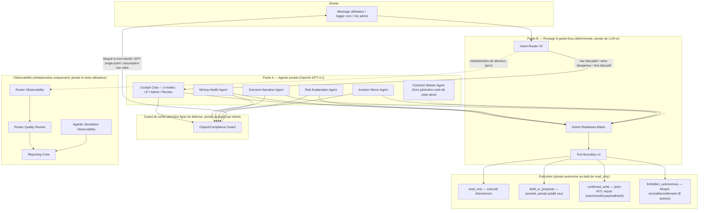

# PIPELINE_SCHEMA.md — Full Agentic Line: Future Schema (skeleton)

> Squelette posé par le batch 1/6 (architect). Aucun des deux schémas Control
> Center/Control Tower existants (`docs/agentic/AGENTIC_CONTROL_CENTER_V0.md`,
> `AGENTIC_VISUAL_CONTROL_CENTER_V0.md`) ne couvre les deux couches de la ligne
> agentique **dans un seul diagramme** : le Control Tower (`/admin/agentic`) topologise
> uniquement la Partie B (orchestration/observabilité), pas les 4 agents batch ni le
> moteur de chat cockpit (Partie A) comme nœuds explicites du même graphe. Ce document
> pose le squelette d'un schéma unifié — **à compléter par un futur batch/série** une
> fois que le comportement réel (canaries DLLM, formulations limites) aura été vérifié
> par les batchs 2-6 de cette série, pas avant (annoter le schéma avec des faits vérifiés,
> pas des hypothèses de doc).

## Pourquoi ce schéma n'existe pas encore ailleurs

- Le Control Tower (`/admin/agentic`, v2) est un registre **statique et read-only** de la
  Partie B uniquement (routeur, guards, HITL gates, tool boundary, crews/agents
  d'orchestration, observabilité). Il ne représente pas les 4 agents batch (Scenario
  Narrative, Mining Health, Risk Explanation, Investor Memo) ni les 3 modes du moteur de
  chat comme nœuds — ceux-ci sont documentés séparément (`docs/spec/09-agents.mdx`,
  `docs/prompts/*.md`).
- Aucun document actuel ne trace le chemin bout-en-bout **entrée utilisateur → routeur
  déterministe → (LLM ou fast-path) → guard de sortie → action readiness → tool
  boundary → exécution (draft/gated/bloqué)** en un seul graphe traversant les deux
  parties.

## Squelette du diagramme (Mermaid, à densifier)

**Légende des styles à ajouter dans une future itération** : nœuds verts = déjà couverts
par cette série (voir `COVERAGE_MATRIX.md`) ; nœuds ambre = couverts indirectement
seulement ; nœuds rouges = gap confirmé. Ce marquage doit être fait **après** les batchs
2-6, pas maintenant (ce batch n'a pas encore de résultat de test à annoter).

## Ce qu'un futur batch de synthèse doit ajouter à ce schéma

1. **Annotations de couverture** par nœud, tirées de `REPORT_SKELETON.md` §4 une fois
   rempli (ex. si le batch 5 confirme un gap sur `mining-health.ts`, marquer le nœud
   `MHA` en rouge avec la raison).
2. **Cas limites observés en pratique** (pas seulement en théorie) — ex. si un canary
   DLLM du batch 5/6 révèle qu'un modèle réel formule parfois une réponse limite non
   couverte par le guard actuel, l'annoter directement sur l'arête `AGENTS --> OG`.
3. **Le swarm outreach** (`outreach_governed_swarm`) comme sous-graphe séparé, une fois
   que la série sœur `outreach-audit` aura documenté son comportement réel — ce schéma
   le laisse volontairement en pointillé (`-.->`) car hors périmètre de code de cette
   série (voir `PROJECT_PLAN.md` §Coordination).
4. **Le Daily Executive Brief Crew (A8)** une fois construit — actuellement absent du
   schéma car non implémenté (design ADR-018 forward uniquement).

## Sources à ne pas dupliquer (déjà correctes, juste pas unifiées)

- `docs/agentic/AGENTIC_VISUAL_CONTROL_CENTER_V0.md` — topologie détaillée de la Partie B
  seule (groupes, nœuds, arêtes) — réutiliser sa nomenclature de types de nœuds
  (router|guard|crew|agent|tool|gate|observability|surface) plutôt que d'en inventer une
  nouvelle si ce schéma est un jour implémenté en composant React réel.
- `docs/spec/09-agents.mdx` — contrats d'entrée/sortie exacts des 4 agents batch (Partie
  A), à citer plutôt qu'à reformuler si le schéma futur a besoin de détail par agent.
